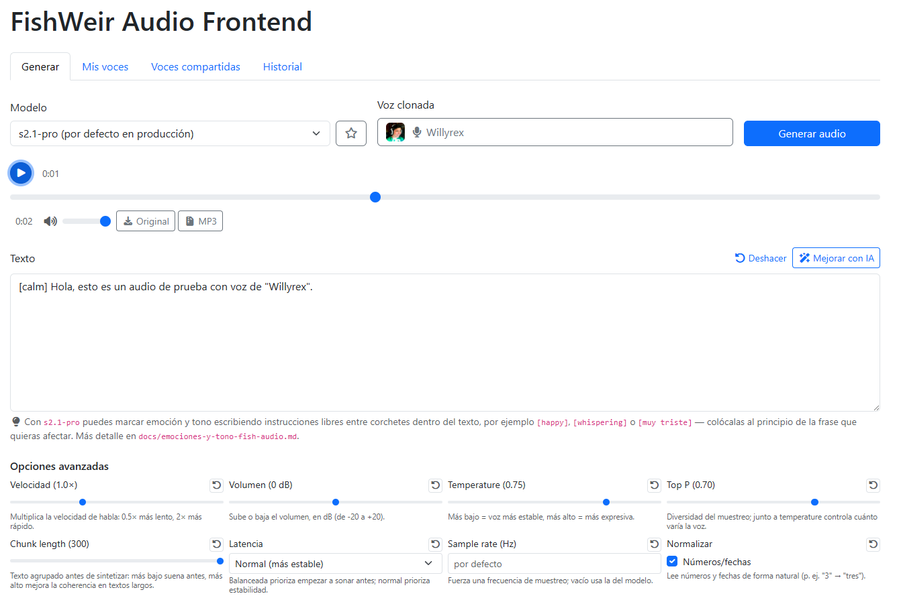
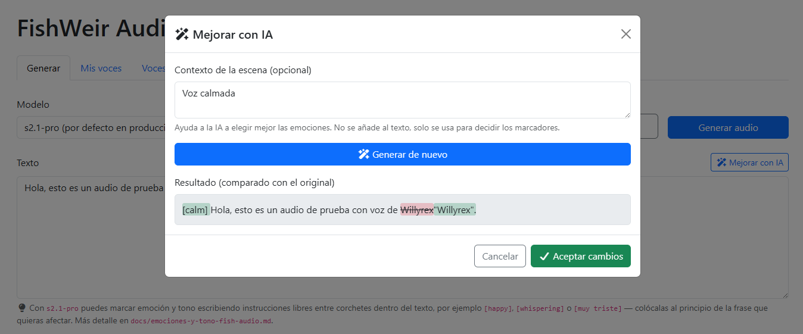
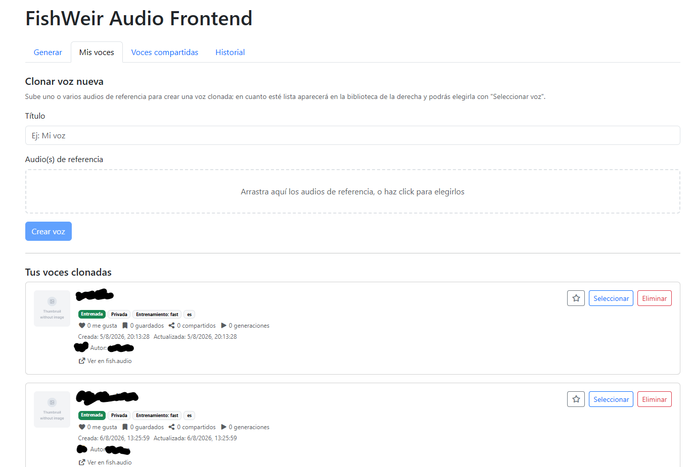
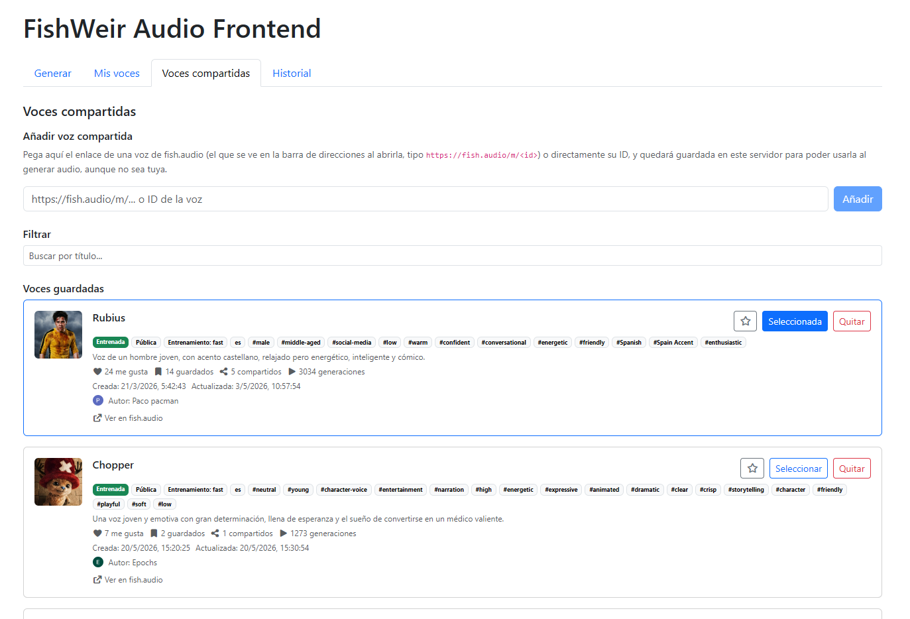
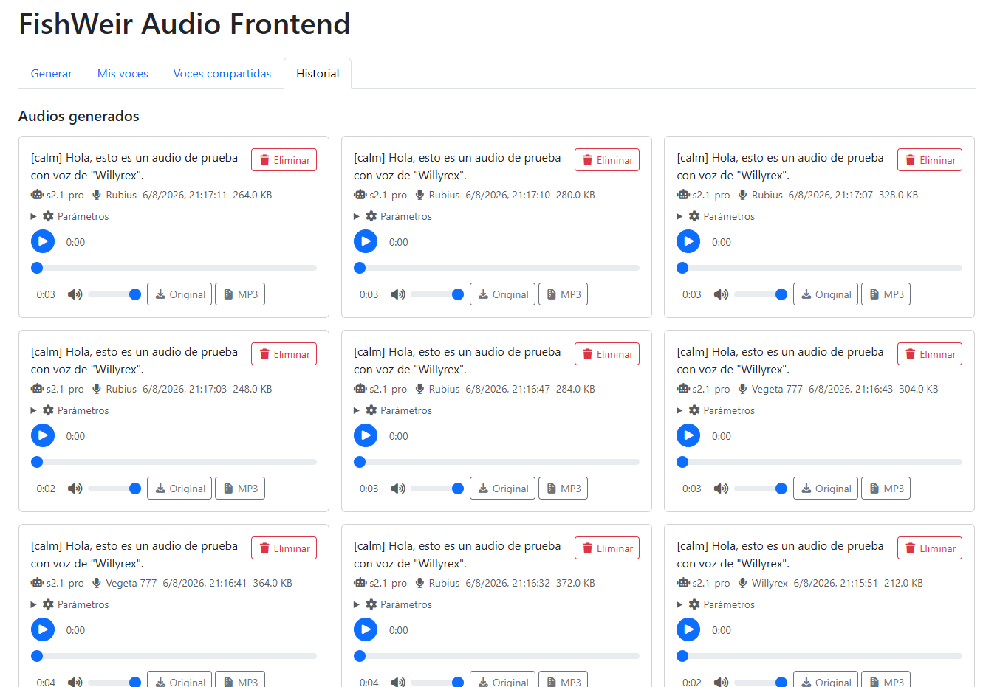

# FishWeir Audio Frontend

<p align="center">
    
</p>

<p align="center">
    <a href="#qué-es-esto">Qué es esto</a> ·
    <a href="#sobre-el-nombre">Sobre el nombre</a> ·
    <a href="#funcionalidades">Funcionalidades</a> ·
    <a href="#modo-de-uso">Modo de uso</a> ·
    <a href="#tecnologías-usadas">Tecnologías usadas</a> ·
    <a href="#galería">Galería</a>
</p>

## Qué es esto

Un frontend con un pequeño backend propio que hace de intermediario con la API de [Fish Audio](https://fish.audio). Generas el audio y él se encarga de guardarlo todo (voces, historial, favoritos) para que puedas trabajar a tu ritmo, exportar a distintos formatos y tener el control de lo que pasa en cada momento, todo desde tu propio escritorio y sin complicarte con peticiones sueltas. Además, incluye una IA que mejora el texto que escribes añadiéndole las emociones que le indiques, para que el audio generado suene más realista.

Es un proyecto nacido de una necesidad personal, no pensado para ser un producto escalable, sin capas ni abstracciones de más, una herramienta rápida. También es una forma de apoyar el open source y las APIs que cobran de forma barata y transparente: Fish Audio me pareció un coste razonable además de que permite un modelo gratuito para pruebas.

Se ha desarrollado con ayuda de IA agéntica para ir más rápido, con revisión y supervisión humana en todo momento (como cualquier desarrollo profesional de hoy en día).

## Sobre el nombre

El nombre "FishWeir" es solo un juego de palabras, nada más. Un "weir" es una compuerta o barrera que tradicionalmente se usaba para dirigir y retener peces en un río; aquí los "peces" son, por analogía, los audios que genera la API, y el "weir" es este propio proyecto, que hace de intermediario y se queda con todo lo que pasa por él (historial, voces, favoritos) para que tú puedas gestionarlo cómodamente. Es una metáfora simpática sobre cómo funciona la herramienta, sin segundas intenciones.

Aclarado esto por si acaso: no tiene ninguna intención maliciosa ni busca insinuar nada raro sobre Fish Audio ni sobre cómo trata tus datos. Todo lo contrario, animo a cualquiera que use este proyecto a comprarle créditos a la API oficial de [Fish Audio](https://fish.audio) y usarla directamente, porque es rápida, cómoda y de muy buena calidad.

## Funcionalidades

- Generar audio a partir de texto (texto a voz), eligiendo modelo, voz clonada opcional y parámetros avanzados de generación.
- Mejorar el texto con IA antes de generar, añadiendo marcadores de emoción y tono (requiere una API key de DeepSeek).
- Listar, crear (clonación instantánea a partir de audios de referencia) y eliminar tus voces clonadas.
- Guardar voces de otros autores por enlace o ID de fish.audio y usarlas igual que las propias.
- Marcar modelos y voces como favoritos para elegirlos rápido sin buscar en los selects.
- Guardar y consultar el historial de audios generados, con reproducción y descarga (wav o mp3 comprimido) y guardando todos los metadatos.

## Modo de uso

### General

1. Instala las dependencias:
   ```
   pnpm install
   ```
2. Configura las variables de entorno del backend:
   ```
   cp backend/.env.example backend/.env
   ```
   Y edita `backend/.env` con tu API key de [fish.audio/app/api-keys](https://fish.audio/app/api-keys) (y el puerto si quieres cambiarlo). También puedes añadir una API key de [DeepSeek](https://platform.deepseek.com/api_keys) (opcional) para activar el botón "Mejorar con IA".

### Producción

La vía rápida: usa el script de la raíz del proyecto para tu sistema, con doble click o desde terminal — `start-prod.sh` (Linux/macOS) o `start-prod.ps1` (Windows). Compilan el frontend y arrancan el backend en producción, dejando la terminal abierta con los logs; al cerrarla se detiene el servidor.

Si prefieres hacerlo a mano, el equivalente es:
```
pnpm run start
```

### Desarrollo

Se recomienda arrancar backend y frontend por separado, cada uno en su propia terminal, así se ven mejor los errores de cada lado:
```
pnpm run dev:backend
```
```
pnpm run dev:frontend
```

Si prefieres arrancarlos juntos en una sola terminal (con la salida de ambos mezclada):
```
pnpm dev
```

Otros comandos útiles:
- `pnpm check:backend` — comprueba tipos del backend.
- `pnpm check:frontend` — comprueba tipos y el componente Svelte del frontend.

## Tecnologías usadas

- **Backend:** Node.js, Express 5, multer, SDK `fish-audio`, SDK `openai` (para DeepSeek), TypeScript — en `backend/` (`backend/server.ts`).
- **Frontend:** Svelte 5, Vite, Bootstrap 5, Font Awesome, ffmpeg.wasm, TypeScript — en `frontend/` (`frontend/src/App.svelte`).
- **Gestor de paquetes:** pnpm.
- **Docs:** guías de referencia en `docs/` (p. ej. emociones y tono para Fish Audio).

## Galería

<p align="center">
    <br>
    <em>Pestaña Generar: modelo, voz clonada, texto con marcadores y opciones avanzadas de generación.</em>
</p>

<p align="center">
    <br>
    <em>Mejorar con IA: compara el resultado con marcadores de emoción frente al texto original antes de aceptarlo.</em>
</p>

<p align="center">
    <br>
    <em>Mis voces: clona una voz nueva a partir de audios de referencia.</em>
</p>

<p align="center">
    <br>
    <em>Voces compartidas: guarda voces de otros autores por enlace o ID y úsalas igual que las propias.</em>
</p>

<p align="center">
    <br>
    <em>Historial de audios generados, con parámetros, reproducción y descarga.</em>
</p>
